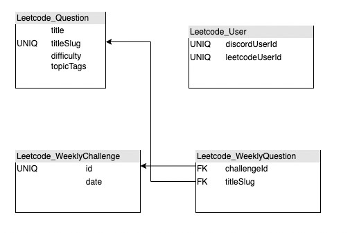

# trainingwheels-bot
Discord bot for the Training Wheels server


## Getting started (the easy way)

The `initialize_app.sh` script is provided to automatically initialize all files required by this program, including:
 - `.process.env` - an environment file with the discord token and database name
 - `bot-env/` - a Python virtual environment with all project dependencies

You can run `initialize_app.sh` by "sourcing" it through your shell.
The `source` command essentially runs the script and exports all environment variables.
```bash
source initialize_app.sh
```

**IMPORTANT**: Remember to activate the Python virtual environment before running the application.
From your shell:
```sh
source bot-env/bin/activate
```

If you have already initialized your environment previously, you only need to activate the Python virtual environment to use the application.

## Getting started (in detail)

First, create a Python virtual environment named `bot-env`
```
python3 -m venv bot-env
```

Next, activate the Python virtual environment
```
source bot-env/bin/activate
```

It is important that you do the command above before continuing. Once inside virtual environment, install dependencies.

```
python3 -m pip install -r requirements.txt
```

When you are finished, if you wish to continue using the terminal for different projects, you should deactivate the Python virtual environment.
```
deactivate
```

Now you can use your shell as normal, just re-activate the virtual environment whenever you want to run this project's code again.

This project uses an environment dot-file named `.process.env`. It is important that this file exists in the root directory of this repository and the file contains the following environment variables:
```
DISCORD_AUTH_TOKEN=""
DATABASE_NAME="db.json"
```

## Running the app
To run the app, first activate your Python virtual environment (if you haven't already)
```
source bot-env/bin/activate
```
Then call the app entry point with
```
python3 src/leetcode_bot.py
```

## App arguments
To run the app in Discord mode, use the `--discord` argument.
```
python3 src/leetcode_bot.py --discord
```
To update the local database on app launch, use the `--update` argument.
```
python3 src/leetcode_bot.py --update
```
These arguments can be combined. If you do not use any arguments, the app will launch in Standalone mode and will use an existing database (if one exists).

## Testing leetcode API access
Make sure you are running in a Python virtual environment before running any of the project code.
You can test interacting with leetcode using the following command, which runs the `leetcode-questions.py` script.
```
python3 leetcode-questions.py
```

## E/R Diagram for Database



`Leetcode_Question` contains all leetcode questions, scraped once at the launch of the app/db.

`Leetcode_User` maps a DiscordID to a Leetcode ID. We would want this for stuff like !leetcode stats or !leetcode rank commands.

`Leetcode_WeeklyChallenge` is the challenge we create each week. It is simple a date and a uniq identifier for "Week 1", "Week 2", etc.

`Leetcode_WeeklyQuestion` is a collection of questions associated with a Leetcode_WeeklyChallenge.